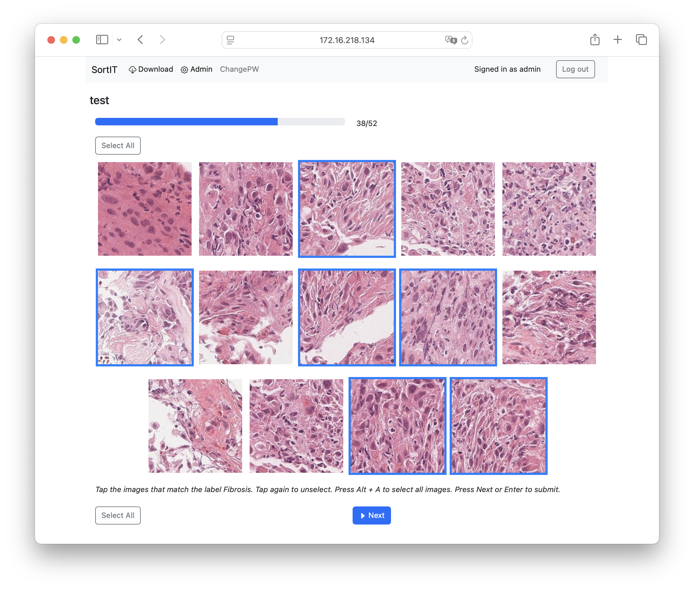

# SortIT

<!--toc:start-->
- [SortIT](#sortit)
  - [Backgound](#backgound)
  - [Getting Started](#getting-started)
  - [Env files](#env-files)
  - [Development Server](#development-server)
  - [Using SortIT](#using-sortit)
  - [Tiling WSI with QuPath](#tiling-wsi-with-qupath)
  - [MIXTURE Method](#mixture-method)
  - [Basic Configuration](#basic-configuration)
  - [Adding Features](#adding-features)
  - [File Structure & Key Files](#file-structure-key-files)
  - [Running Tests](#running-tests)
  - [Troubleshooting](#troubleshooting)
  - [LICENCE](#licence)
<!--toc:end-->

Easy image labeling tool for multiple users.

## Backgound

SortIT is a web application that allows multiple users to label the same image set. The author, a pathologist, developed this application to facilitate research using machine learning models, with the main target being the classification of pathological image patches. Pathological images are known to have low inter-observer agreement in diagnosis. This application can be used to analyze variation in judgment between observers or to obtain gold-standard ground truth labels.



## Getting Started  

```bash
# Clone repo
git clone https://github.com/FukuokaLab/SortIT.git
cd SortIT

# Install dependencies
uv sync
source .venv/bin/activate

# Set up app
cp .env.example .env
python manage.py makemigrations
python manage.py migrate
python manage.py createsuperuser

# Run app
python manage.py runserver 0.0.0.0:8000
```

1. **Clone the repository**  
2. **Install the required packages** ([uv](https://docs.astral.sh/uv/#installation) recommended)
3. **Apply database migrations**  
4. **Create a super‑user (for admin access)**  
5. **Run the app server**

Dependencies are listed in the `pyproject.toml` file. Pip can also be used to install these dependencies. 

---

## Env files

example of .env (for development)
```
SQL_ENGINE=django.db.backends.postgresql
POSTGRES_NAME=postgres
POSTGRES_DB=sortimg
POSTGRES_USER=postgres
POSTGRES_PASSWORD=pass_for_db
SQL_HOST=db
SQL_PORT=5432
SECRET_KEY=xxxxxxxxxxxxxxxxxxxxxxxxxxxxxxxxxx
DJANGO_ALLOWED_HOSTS=localhost 127.0.0.1
DEBUG=True
SERVER_NAME=my_host_name.com

DJANGO_SUPERUSER_USERNAME=admin
DJANGO_SUPERUSER_EMAIL=admin@gmail.com
DJANGO_SUPERUSER_PASSWORD=admin_pass
```

You may have to add the address you use to connect to the server to `DJANGO_ALLOWED_HOSTS`. If connecting from the same machine, localhost is already added. Add new entries with a space separating them. Otherwise, you should be able to run the app with the above settings.
For example, if your machine has the ip address 192.168.1.5, then you should add this to the allowed hosts so you can connect to 192.168.1.5:8000 in your browser.

## Development Server  

To start the Django development server that listens on all network interfaces:

```bash
python manage.py runserver 0.0.0.0:8000
```

- `0.0.0.0` exposes the server on your machine’s IP address (e.g., 192.168.1.5).  
- `8000` is the port number; you can pick any free port if 8000 is occupied.

**Connecting from a Browser**  
Open a web browser on the same machine and type the following into the address bar:  

```
localhost:8000
```  

or, if you want to access from another device (on the same network), use the IP address:

```
<your‑machine‑ip>:8000
```  

Example: `192.168.1.5:8000`.

If you see the login page, the server is running correctly.

> [!NOTE]
> This setup is not suitable for production deployment over the internet. 
> We will add documentation regarding deployment with gunicorn and docker.

---

## Using SortIT

1. Creating a Project
After setting up the administrator account (`createsuperuser`) and logging in for the first time, the app will direct to the "Add project" page. 
Fill out the fields (description fields are always optional), and click save.

2. Creating an Image Set
On the left side of the window, click "Add" next to "Image sets". Fill out the name, add it under the project created in step one, and create labels for this image set. Labels can be created by using the link on the sidebar, or by clicking the green + mark on this page.

3. Uploading Images
Once the image set is created, click "View Site" at the top of the page.
Select your project, then click "Upload" for the image set you would like to upload images for.
Click on `Folders` or `Files` to open a file selection window, or drag and drop your tiles. 
Click "Upload" to begin processing your files.

4. Sorting Image Sets
For an imageset with one label, you can upload patches, then click on patches which do not belong. Annotations will be saved per-image, per-user.

5. Exporting Labels
Either at the project level, or for individual image sets, you can click "Export CSV" to get a spreadsheet of images and labels for each user.

> [!IMPORTANT]
> Please note that this app does not create patches/tiles from WSI. You must do this separately, then you can upload the patches to this page for labeling.

---

## Tiling WSI with QuPath

Here is a code snippet which should be able to export patches from QuPath

```groovy
// Author: Tom Bisson
// Affiliation: Institute of Pathology, Charité-Universitätsmedizin Berlin, Berlin, Germany
// Date: January 17, 2024
// Instructions: First higlight the area of tissue that should be exported with an annotation tool

int patch_size = 224
def image_extension = ".png"
def image_data = getCurrentImageData()

def out_path = "INSERT PATH HERE e.g. C:\\Users\\example\\Documents\\images for windows"

tile_exporter = new TileExporter(image_data)
tile_exporter.imageExtension(image_extension)
tile_exporter.tileSize(patch_size)
tile_exporter.annotatedTilesOnly(true)
tile_exporter.writeTiles(out_path)
```


---

## MIXTURE Method

Similar to the method described in the [MIXTURE paper (W. Uegami et al 2022)](https://www.nature.com/articles/s41379-022-01025-7), one way to use this app is as follows:

1. Extract patch features using a feature extraction model.
Pretrained feature extractors are avaiable from pytorch `timm` and various foundation models are now becoming popular.

2. Cluster the patch features
Use a clustering library like [scikit-learn](https://scikit-learn.org/stable/modules/clustering.html#clustering) to cluster the patches by their feature embeddings. KMeans is fast and typically does a good enough job with `n_clusters = 50`.

3. Medical experts can identify clusters
Trained experts can quickly scan through the clusters and identify broadly what they contain. Some clusters are too mixed to be useful, but other clusters will be mostly comprised of one tissue type.

4. Upload clusters to SortIT for cleaning 
Clusters which are mostly of one tissue type but have some incorrect patches inside can be uploaded to SortIT and quickly filtered. 
Multiple users can give annotations, which should allow for better ground truth labels.

---

## Basic Configuration  

All global settings live in `project/settings.py`.  

Typical things you might edit:

| What you want to change | Where to edit |
|-------------------------|---------------|
| Static / media file URLs | `STATIC_URL`, `MEDIA_URL` |
| Logging to a file | `LOGGING` |

---

## Adding Features  

Below are common feature ideas and the files you’ll touch to add them.

| Feature | Files to Edit | What to do (brief) |
|---------|---------------|--------------------|
| **Timer for annotation time** | `sortIT/models.py`, `sortIT/views/`, `sortIT/templates/annotate.html`, optional `static/js/annotate_timer.js` | Add a `DurationField` to store time spent. In the view, start a timer when the page loads and capture the elapsed time when the user saves or navigates away. In the template, embed a small JavaScript snippet that reports the elapsed time back to the server. |
| **Custom user permissions** | `users/models.py`, `project/permissions.py`, `sortIT/views/` | Subclass Django’s `User` model or create a profile. Use Django’s permission system to gate access to certain image sets. |
| **Bulk upload of image sets** | `sortIT/management/commands/upload_imageset.py`, `sortIT/forms.py` | Write a custom management command to ingest CSV/JSON descriptors. In the form, provide a file input that triggers the command. |

> **Tip**: When changing almost anything in `models.py`, remember to run  
> ```bash
> python manage.py makemigrations
> python manage.py migrate
> ```  

---

## File Structure & Key Files  

```
SortIT
├── account/
├── assets/
├── doc/
├── logs/
├── media/
├── project/
│   ├── settings.py
├── sortIT/
│   ├── migrations/
│   ├── templates/
│   │   └── sortIT/
│   │       ├── download.html
│   │       ├── imageset_list.html
│   │       ├── label.html
│   │       ├── project_list.html
│   │       ├── sort.html
│   │       ├── thankyou.html
│   │       └── upload.html
│   ├── apps.py
│   ├── forms.py
│   ├── models.py
│   ├── signals.py
│   ├── tests.py
│   ├── urls.py
│   └── views/
│       ├── finish.py
│       ├── imageset_list.py
│       ├── images.py
│       ├── label.py
│       ├── project_list.py
│       └── sort.py
├── static/
│   └── admin/
├── templates/
│   ├── admin/
│   └── base.html
├── manage.py
└── pyproject.toml
```

**Top‑level files**

| File | What it is | Why it matters |
|------|------------|----------------|
| **`manage.py`** | A thin wrapper around Django’s command‑line interface. | Lets you run commands such as `runserver`, `migrate`, `shell`, `test`, etc. |
| **`pyproject.toml`** | File which describes project dependencies and settings. | Ensures environments will align on different machines |

---

**`project/`** – The django project configuration

| File | Purpose |
|------|---------|
| **`settings.py`** | Global Django settings: database, installed apps, middleware, static files, etc. |
| **`urls.py`** | Root URL dispatcher – points to the URLs defined inside apps. |
| **`wsgi.py`** | WSGI entry point for deploying with a web server (Gunicorn, uWSGI, etc.). |
| **`asgi.py`** | ASGI entry point for async servers or channels. |

---

**`sortIT/`** – The core app (the main feature)

| File | Purpose |
|------|---------|
| **`__init__.py`** | Marks the directory as a Python package. |
| **`apps.py`** | Configures the app (name, ready hook). |
| **`forms.py`** | Defines Django forms for user input (e.g., image upload). |
| **`models.py`** | Declares the database tables: `ImageSet`, `Annotation`, etc. |
| **`signals.py`** | Connects callbacks to model events (e.g., auto‑generate thumbnails). |
| **`urls.py`** | Lists all URL patterns that belong to this app. |
| **`tests.py`** | Basic unit tests that exercise the app’s logic. |
| **`migrations/`** | Auto‑generated scripts that build/alter the database schema. |
| **`templates/sortIT/`** | HTML templates that are rendered to users. |
| **`views/`** | Separate Python modules that contain view functions for each page: |
| | `project_list.py`, `imageset_list.py`, `images.py`, `label.py`, `sort.py`, `finish.py`. |
| **`static/`** | Static assets (CSS, JS, images) that the templates load. |

---

**`account/`** – Optional user‑management app

| File | Purpose |
|------|---------|
| **`models.py`** | Custom `User` or related profile model. |
| **`forms.py`** | Forms for signup, login, password change, etc. |
| **`views.py`** | Handles authentication logic. |
| **`urls.py`** | Routes user‑related URLs (login, logout, sign‑up). |
| **`templates/account/`** | HTML pages for those actions (login.html, sign_up_done.html, …). |

---

**`static/`** – Global static files

| Directory | What it holds |
|-----------|---------------|
| **`admin/`** | Admin site styling and JavaScript (provided by Django). |

---

**`templates/`** – Global templates

| Folder | Content |
|--------|---------|
| **`base.html`** | The master template that other templates extend (common header/footer). |

---

**`media/`** – Uploaded files

| File | What it is |
|------|------------|
| `media/` directory | Stores user‑generated content that is set via `MEDIA_URL` and `MEDIA_ROOT` in `project/settings.py`. |

---

## Running Tests  

The repository ships with basic tests in `sortIT/tests.py`.

```bash
python manage.py test
```

If you add new features, create a corresponding test.

---

## Troubleshooting  

| Symptom | Possible Cause | Quick Fix |
|---------|----------------|-----------|
| `ModuleNotFoundError: No module named 'django'` | Python path not set or virtual environment not activated | Run `source .venv/bin/activate` and re‑install dependencies with `uv sync` |
| Port 8000 already in use | Another process is listening | Choose another port, e.g. `python manage.py runserver 0.0.0.0:8001` |
| Browser shows “Could not connect” | Server not running or firewall blocking | Confirm `runserver` output, check network connectivity, ensure firewall allows the port |
| Database errors on first run | Migrations missing | `python manage.py makemigrations` and `python manage.py migrate` |
| Static files not loading | `STATIC_URL` misconfigured | Check `STATIC_URL` in settings |

---

## LICENCE
MIT
